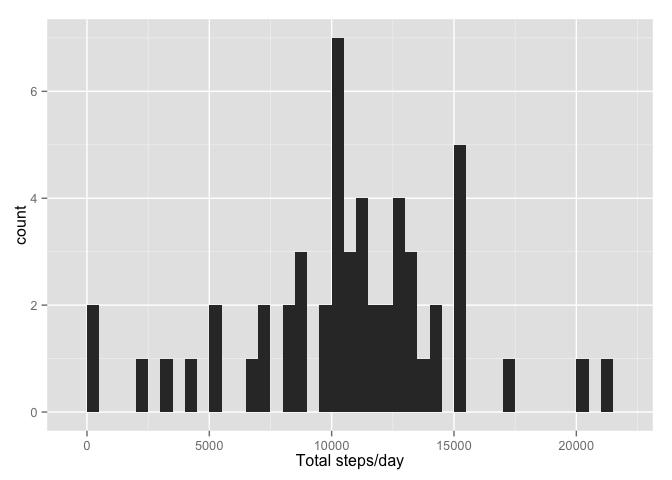

# Reproducable Research (repdata-007) -- Project 1
brockwebb45@gmail.com  
October 17, 2014  

#  <font -1> Data Loading and Preprocessing


```r
if(!exists("activity.csv")){
       unzip("activity.zip")
       }

activity_data <- read.csv("activity.csv", header=TRUE)
activity_data$date <- as.Date(activity_data$date, format="%Y-%m-%d")
```

# Finding the mean (average) total number of steps per day

NA values can be ignored for this step:

```r
data_noNA <- na.omit(activity_data)
```

## Histogram of the total steps per day

```r
library(plyr)
library(ggplot2)

sum_data <- ddply(data_noNA, 'date', summarize, steps=sum(steps)) 
qplot(sum_data$steps, binwidth=500, xlab="Total steps/day")       
```

 

## Mean and median number of steps per day

The mean (average) number of steps per day is: 

```r
mean(sum_data$steps)
```

```
## [1] 10766.19
```
The median (middle) number of steps per day is: 

```r
median(sum_data$steps)
```

```
## [1] 10765
```

# Looking at the average daily pattern

## Time series: Daily Average for each 5 minute interval

```r
sum_data.dailyavg <- ddply(data_noNA, 'interval', summarize, steps=mean(steps)) 

ggplot(data=sum_data.dailyavg, aes(x=interval,y=steps)) +
     geom_line() +
     xlab("5-Minute Interval") +
     ylab("Average number of steps")
```

 

## Which time interval, on average, contains the maximum number of steps?

```r
maxAvgSteps <- sum_data.dailyavg[which.max(sum_data.dailyavg$steps),] #returns the row and vals
print(maxAvgSteps)
```

```
##     interval    steps
## 104      835 206.1698
```

# Inputing missing (e.g. NA) values with substitution 
This section will look at using a method of substitution for NAs in the data set. 

## Counting the number of NA's in the data set
The number of NA values in the activity.csv data set are:

```r
sum(is.na(activity_data))
```

```
## [1] 2304
```

## Method for substitution
My method will esentially use the sum_data.dailyavg table as a lookup table. Wherever there 
is an "NA" at any interval, I'll substitute the missing value with the average value at that 
time interval for all days combined.

## Create a new data set with the substitution scheme outlined above

```r
# Create a copy of the original (just in case something goes wrong, its preserved)
data.NA.replace <- activity_data

for(i in 1:nrow(data.NA.replace)) {
     if (is.na(data.NA.replace$steps[i])) {
          pos <- which(data.NA.replace$interval[i] == sum_data.dailyavg$interval)
          data.NA.replace$steps[i] <- sum_data.dailyavg$steps[pos]
     } # I broke this function apart for readibility, could have done in one line...
}
```

## Histogram of total number of steps with substitution, new mean/median comparison to original

```r
library(plyr)
library(ggplot2)

sum_data.NA.replace <- ddply(data.NA.replace, 'date', summarize, steps=sum(steps)) 
qplot(sum_data.NA.replace$steps, binwidth=500, xlab="Total steps/day")       
```

 

### Mean and median number of steps per day (with substitution)

The mean (average) number of steps per day is: 

```r
mean(sum_data.NA.replace$steps)
```

```
## [1] 10766.19
```
The median (middle) number of steps per day is: 

```r
median(sum_data.NA.replace$steps)
```

```
## [1] 10766.19
```


### Difference between means and medians before/after substitution 

```r
library(data.table)

bmean = mean(sum_data$steps)
bmedian = median(sum_data$steps)
amean = mean(sum_data.NA.replace$steps)
amedian= median(sum_data.NA.replace$steps)

dt = data.table("Stat"=c("Mean", "Median"),"Before Subst"=c(bmean,bmedian),
                "After Subst"=c(amean,amedian),
                "Delta"=c((bmean-amean),(bmedian-amedian)))
print(dt)
```

```
##      Stat Before Subst After Subst     Delta
## 1:   Mean     10766.19    10766.19  0.000000
## 2: Median     10765.00    10766.19 -1.188679
```

Overall, the impact to the data was small with the substitution scheme used. Somehow the mean equaled the median after substitution, and that may have been luck. Because a small number of NAs were substituted with an average value, the overall average change in the data distribution stayed about the same. Using substitution always requires good judgement when and when not to use.  

# Differences in activity patterns: weekdays vs. weekends

## Creating a weekend/weekday factor for the table

```r
data.NA.replace$weekfactor <- ifelse(weekdays(data.NA.replace$date) %in% c("Saturday", 
     "Sunday"),"weekend", "weekday")
```

## Panel plot comparing weekend/weekday step averages for the 5-minute intervals

```r
sum.weekfactor <- ddply(data.NA.replace, .(interval,weekfactor), summarize, steps=mean(steps))

ggplot(data=sum.weekfactor, aes(x=interval,y=steps, color=weekfactor)) +
     facet_grid(weekfactor ~ .) +
     geom_line() +
     xlab("5-Minute Interval") +
     ylab("Average number of steps") +
     theme(legend.position="none")  # removing because unnecessary (facets are labeled)
```

 
